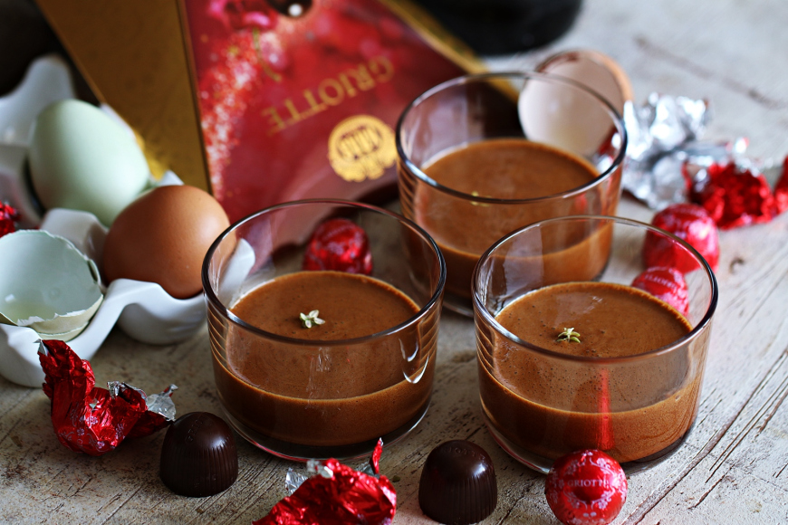

## Zabaione s griottama (vinski šato)

08.01.2020.

Talijani ga zovu zabaione, zabajone ili zabaglione, Francuzi pak sabayon, a kod nas je poznat kao vinski šato ili vajnšato. 
U osnovi, sastojci za ovu divnu, pjenastu kremicu, koja svoje korijene vuče sa sjevera Italije, vrlo su jednostavni i malobrojni; žumanjci, šećer i slatko desertno vino. I to je to!

Zabaione, ta divna, žuta pjenasta krema, od milja zvana „desert za odrasle“ zbog toga što je jedan od glavnih sastojaka alkohol, u svom se izvornom obliku služi u čašama uz dodatak piškota ili prhkih keksa, 
odličan je dodatak kolačima, ali i famozan preljev za palačinke. Sjećate se palačinki s orasima u vajnšatou? 
Bile su to palačinke koje su se nekad davno, prije svih ovih čoko-lješnjak namaza, često našle na našem stolu, 
a danas su pomalo zaboravljene. Valjalo bi ih oživjeti.
A znate li kako je zabaione dobio ime? Postoje mnoge priče i legende o tome otkud naziv zabaione, a jedna od njih kaže kako je 
početkom 16. stoljeća u Torinu živjela zajednica franjevaca, a među njima i španjoski monah Pasquale de Baylon. 
Prema pričama, ovaj je redovnik bio poprilično poznat u tadašnjoj zajednici i njegovo se ime često spominjalo među 
stanovnicima Torina. Vjerojatno se pitate zašto?!

Poznatim ga je učinio upravo recept za kremu od jaja koja je bila u stanju probuditi i „najuspavanije“ muževe. 
Tako su mnoge dame iz Torine kucale na vrata oca de Baylona žaleći se na svoje muške polovice, a fratar bi im potom propisao prirodni afrodizijak na bazi žumanjaka, šećera i slatkog vina (najčešće Marsale) – zabaione. Uspjeh ove desertne kreme je bio toliko velik da se recept prenosio s majke na kćeri te se prešavši granice savojskog kraljevstva proširio po čitavom svijetu pod lokalnim nazivom „sanbajon“ koje je, u stvari, izvedenica imena redovnika Baylona, ​​kasnije proglašenog svecem i danas poznatog kao San Pasquale Baylon.
Danas postoje različite verzije ove aromatične, a jednostavne kreme; 
postoji zabaione s rumom, s kavom, s čokoladom, pa čak i s citrusima.