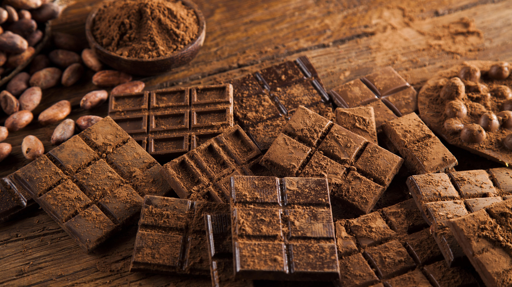
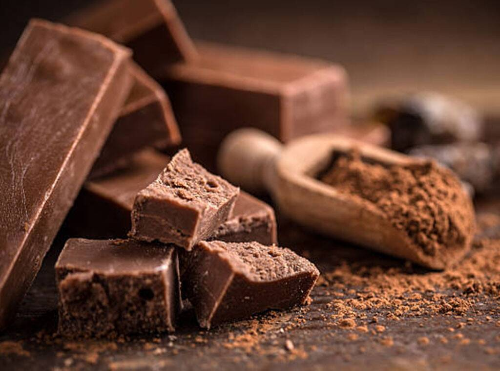

## Čokolada

Čokolada je poslastica koja se dobiva miješanjem kakaove mase s većom ili manjom količinom šećera. 
Najčešće na tržište dolazi u obliku pločica. Ime potječe iz vremena kada se čokolada više pila kao napitak iz 
riječi Xocóatl ili chocolatl (xoco što znači gorko i atl voda), od čega se dalje proširila po drugim indoeuropskim jezicima, 
pa je ušla u engleski kao chocolate, njemački Schokolade, španjolski chocolate, francuski chocolat. U današnjem nahuatlu zove se 
xocolātl.
Plod drveta kakaovca daje osnovnu sirovinu u proizvodnji čokolade, to je kakao (u astečkom cacaotl), 
neugledna je biljka što raste u tropskoj šumi od južnog Meksika do bazena Amazone.

### Povijest čokolade

Pretpostavlja se da su Olmeci još prije 2.600 godina kuhali čokoladnu smjesu. Visoko razvijena civilizacija Maja u travnju je 
priređivala slavlja u čast boga kakaa Ek Chuaha, tijekom kojega bi se prinosile životinjske žrtve i dijelili pokloni, a zrna 
kakaovca bila su prihvaćena kao sredstvo plaćanja. U Meksiku su potvrđena slična slavlja.
Sa svojih putovanja po Južnoj Americi Kristofor Kolumbo donio je na španjolski dvor i sjeme kakaovca, 
ali nije pobudilo nikakvo zanimanje. Tek će španjolski konkvistador Hernán Cortés kada krene u osvajanje 
Južne Amerike i uništavanje tamošnjih civilizacija probati Xocolatl, toplu kakaovu tekućinu koju mu je ponudio 
astečki vladar Montezuma u golemim zlatnim peharima.
Asteci su čokoladni napitak pili zagrijan i bez trunke slatkoće, ali su dodavali začine poput 
vanilije i čilija, a tek će Europljani od čokolade napraviti slatkiš. Španjolski redovnici su prvi u Europi 
pripravljali čokoladu, još uvijek tekuću, počeli su dodavati šećer i cimet, ali tajnu nisu mogli dugo skrivati.
Čokolada kakvu poznajemo danas je novijeg nadnevka i to zahvaljujući Nizozemcu Conradu J. van Houtenu, koji je 1828. g. 
patentirao hidrauličnu prešu koja je mrvila zrna kakaovca iz kojeg je nastao kakao prah. Englezi (Joseph Fry) su 1847. g. 
otkrili kako taj prah miješati sa šećerom i rastopljenim kakao maslacem te je takva nova čokolada postala ubrzo omiljena i 
bila je to prva čokolada za jelo. Švicarac Daniel Peter je eksperimentirao s mlijekom kao sastojkom u čokoladi i uspio je proizvesti 
prvu mliječnu čokoladu 1875. g.
Dalje su Švicarci usavršavali proizvodnju čokolade i godine 1879. Rudolf Lindt (Lindt je danas jedna od najpoznatijih tvornica čokolade) 
napravio je čokoladu koja se topila u ustima (poznata i po nazivu "chocolat fondant").

### Zablude o čokoladi

* "Uzrokuje karijes" - Nedostatak higijene uzrokuje propadanje zuba i bilo koja hrana koja sadrži fermentirajuće ugljikohidrate, a zapravo neke tvari u čokoladi usporavaju kvarenje zuba.
* "Uzrokuje akne" - Niz istraživanja dokazao je da se jedenjem čokolade ne povećava broj akni.
* "Deblja" - Kao i svaka hrana u pretjeranim količinama i čokolada deblja, ali kockica-dvije sprečava prejedanje u krizama i zadovoljava želju, bitna je umjerenost.
* "Ima puno kofeina" - U kockici čokolade znatno je manje kofeina nego u šalici kave, čaju ili kola napitcima.
* "Povećava razinu kolesterola" - Kakao maslac, tj. masnoća iz zrna kakaa, unatoč visoko zasićenim masnoćama ne podiže razinu kolesterola u krvi. Stearinska kiselina, jedna od glavnih masnih kiselina u kakao maslacu, drugačije se iskorištava u tijelu i može sniziti razine kolesterola u krvi.
* "Izaziva ovisnost" - To nije točno, iako neki ljudi imaju jače izražen apetit za čokoladu od drugih. Često konzumiranje čokolade može postati navika koja osigurava užitak i mnogo energije, ali samo jedenje čokolade ne može postati ovisnost.
