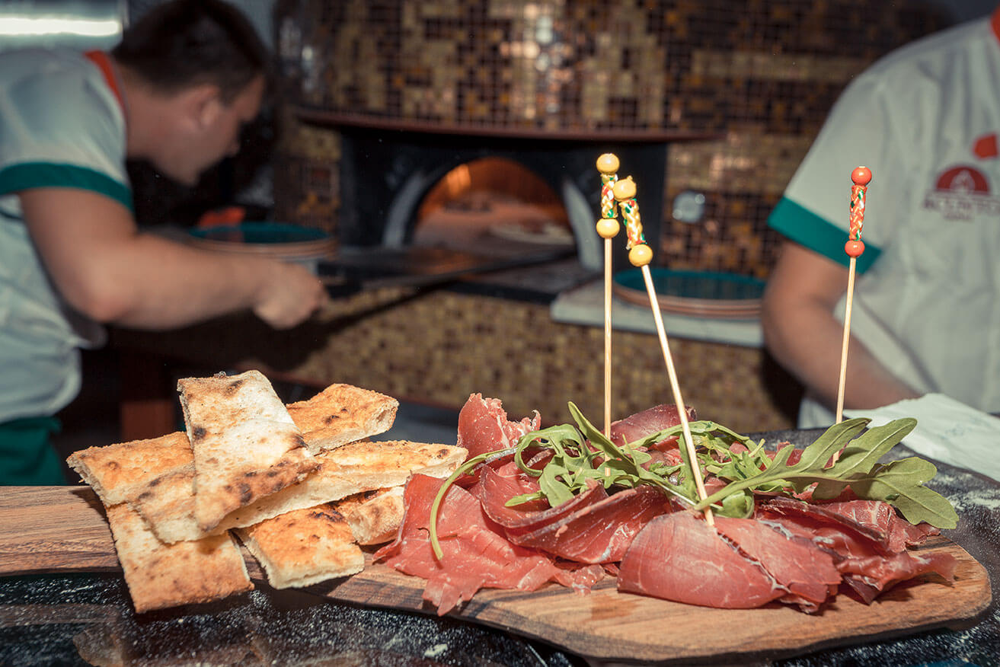

## Basta Gourmet Bar

Izvorna napuljska receptura kao glavni sastojak svih delicija, unikatna pića s potpisom vrhunskog koktel majstora, 
nezaboravna druženja u opuštajućem i posebno dizajnerski osmišljenom interijeru – riječi su ovo koje najbolje opisuju 
gastro koncept pod imenom Basta Gourmet Bar, a koji se nakon tri uspješne sezone u Zagrebu upravo doselio i na atraktivnu 
splitsku adresu. Zapadna obala tako je bogatija za novo IN mjesto koje povezuje istinske napuljske specijalitete i pizze, 
simbol talijanske kuhinje i stila života, maštovite koktele i jedinstveni pogled na splitsku Rivu i otoke.

Kako se Basta u samo nekoliko mjeseci probila na sam vrh zagrebačke gastro scene, 
taj će recept slijediti i na novoj adresi. Tako će se i na splitskom meniju naći selekcija sireva Gligora, 
San Daniele pršut, domaće pikantne salame, zanimljive i ukusne kombinacije foccacia i bruschetta, salate ali i 
zanimljive napuljske pagnutttielle. Istinski ljubitelji talijanskog kultnog specijaliteta moći će uživati u pravim 
okusima pizze napolitane koja se priprema prema originalnoj recepturi i s izvornim talijanskim i organskim sastojcima. 
Poznata po neodoljivoj, hrskavoj i zlatnoj kori, tankoj samo tri milimetra koja se peče nevjerojatnih 60 do 90 sekundi, a rajčica, 
mozzarela, pršut, inćuni, tuna i kozice samo su neki od sastojaka koji će ih začiniti s potpisom kreativnog tima Baste.

Novi se prostor Basta Gourmet Bara ističe zanimljivim dizajnom koji povezuje rustikalni i moderni stil.
U prostoru prevladavaju boje, šareni dezeni te vintage detalji, a prilikom uređenja vlasnici su se vodili mišlju 
da stvore ugodan i opušten ambijent koji će se idealno uklopiti uz šetnicu na zapadnoj obali smještenoj tik uz more. 